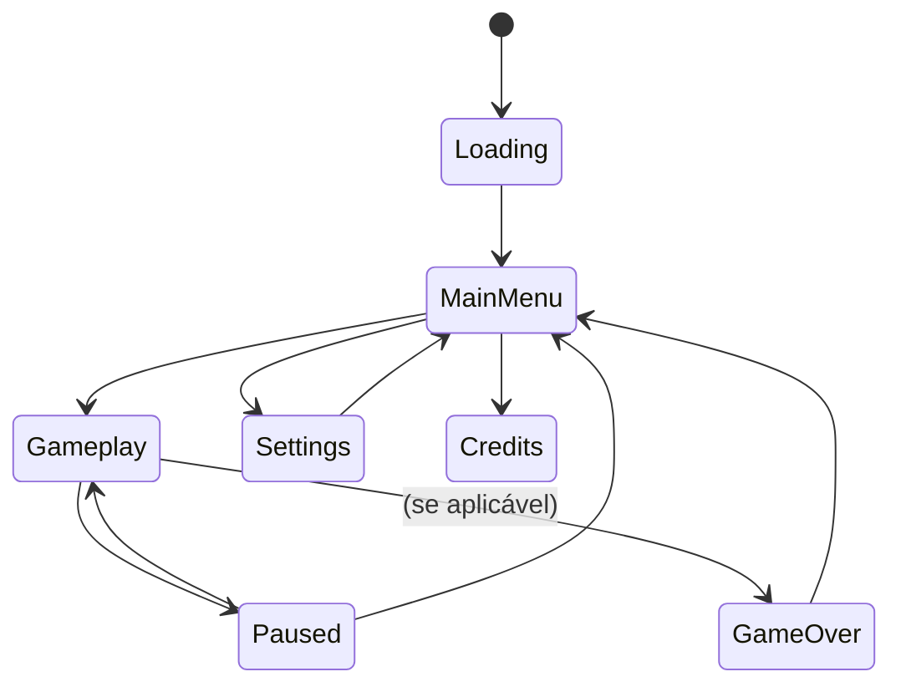

# Game Design Document (GDD)

## Propósito deste Documento

Esta é a "Bíblia do Design". Aqui descrevemos as regras do jogo. Se não estiver escrito aqui, não deve ser programado. Serve para garantir que a visão da mecânica esteja clara antes de escrever código.

> ⚠️ **Nota:** Este documento usa nomenclatura genérica (`Projectile`, `Target`, `Currency`) pois o tema visual ainda não foi definido. Os nomes serão atualizados quando a direção artística for escolhida.

---

## Core Loop

O ciclo fundamental que o jogador experimenta repetidamente:

```
┌─────────────────────────────────────────────────────────┐
│                                                         │
│    [1. SPAWN]          [2. PHYSICS]        [3. HIT]    │
│    Projéteis    ───►   Movimento     ───►  Colisão    │
│    são criados         e rebotes           com alvo    │
│                                                         │
│         ▲                                     │         │
│         │                                     ▼         │
│                                                         │
│    [5. UPGRADE]        [4. REWARD]                     │
│    Jogador      ◄───   Alvo destruído                  │
│    compra melhorias    = Currency                       │
│                                                         │
└─────────────────────────────────────────────────────────┘
```

### Detalhamento do Loop

| Etapa      | Descrição                                                      |
|------------|----------------------------------------------------------------|
| **Spawn**  | Projéteis são gerados automaticamente em intervalos definidos  |
| **Physics**| Projéteis se movem, colidem com paredes e rebatem              |
| **Hit**    | Ao colidir com alvo, aplica dano baseado nos upgrades          |
| **Reward** | Alvo destruído gera Currency proporcional à sua vida máxima    |
| **Upgrade**| Jogador investe Currency para melhorar atributos               |

---

## Mecânicas Detalhadas

### Sistema de Física

O jogo utiliza o motor de física 2D nativo do Unity (Box2D).

**Configurações Base:**

| Parâmetro          | Valor       | Descrição                              |
|--------------------|-------------|----------------------------------------|
| Gravity Scale      | 0           | Sem gravidade (espaço 2D)              |
| Bounciness         | 1.0         | Rebote perfeito (sem perda de energia) |
| Friction           | 0           | Sem atrito nas paredes                 |
| Linear Drag        | 0           | Projéteis não perdem velocidade        |
| Collision Detection| Continuous  | Evita tunneling em alta velocidade     |

**Comportamento de Colisão:**

```csharp
// Collision Matrix (Layers)
// Projectile x Projectile = OFF (não colidem entre si)
// Projectile x Target     = ON  (causa dano)
// Projectile x Wall       = ON  (rebate)
// Target x Target         = OFF (não colidem entre si)
// Target x Wall           = ON  (spawnam dentro dos limites)
```

### Sistema de Dano

Quando um projétil colide com um alvo:

1. Calcula dano base do projétil
2. Aplica multiplicadores de upgrade
3. Verifica crítico (se upgrade desbloqueado)
4. Subtrai do HP do alvo
5. Se HP ≤ 0, alvo é destruído

```
DanoFinal = DanoBase × MultiplicadorUpgrade × (CritMultiplier se crítico)
```

### Sistema de Spawn (Projéteis)

**Regras de Spawn:**

- Projéteis spawnam em posição fixa (ou múltiplas posições com upgrade)
- Direção inicial: aleatória dentro de um cone configurável
- Intervalo entre spawns: definido por upgrade `SpawnRate`

**Limites de Performance:**

| Parâmetro            | Valor Padrão | Configurável |
|----------------------|--------------|--------------|
| Max Projéteis Ativos | 500          | Sim (Remote Config) |
| Max Alvos Ativos     | 100          | Sim (Remote Config) |

### Sistema de Spawn (Alvos)

**Regras de Spawn:**

- Alvos spawnam quando quantidade ativa < limite
- Posição: aleatória dentro da área de jogo
- HP escala com o progresso do jogador (ver Economy doc)
- Forma/Tamanho: variável (se múltiplos tipos implementados)

---

## Sistema de Upgrades

### Categorias de Upgrade

| Categoria       | Efeito                                    | Tipo de Escala |
|-----------------|-------------------------------------------|----------------|
| **Damage**      | Aumenta dano por hit                      | Multiplicativo |
| **Spawn Rate**  | Reduz intervalo entre projéteis           | Aditivo        |
| **Projectile Count** | Mais projéteis por spawn             | Aditivo        |
| **Crit Chance** | % de chance de dano crítico               | Aditivo        |
| **Crit Damage** | Multiplicador quando crítico              | Multiplicativo |
| **Offline Gain**| Aumenta eficiência de ganhos offline      | Multiplicativo |

### Estrutura de Upgrade

```csharp
// Modelo conceitual
public class UpgradeDefinition
{
    string Id;              // "damage_01"
    string DisplayName;     // Definido após escolha do tema
    int CurrentLevel;       // 0 a MaxLevel
    int MaxLevel;           // -1 para infinito
    BigDouble BaseCost;     // Custo no nível 0
    float CostMultiplier;   // Geralmente 1.15
    float EffectPerLevel;   // +10% dano por nível, etc
}
```

### Upgrades Planejados (v1.0)

| ID              | Efeito Base     | Custo Base | Multiplicador | Max Level |
|-----------------|-----------------|------------|---------------|-----------|
| `damage`        | +10% dano       | 10         | 1.15          | ∞         |
| `spawn_rate`    | -0.1s intervalo | 50         | 1.20          | 50        |
| `proj_count`    | +1 projétil     | 500        | 1.50          | 20        |
| `crit_chance`   | +1% crit        | 100        | 1.25          | 75        |
| `crit_damage`   | +10% crit dmg   | 200        | 1.30          | ∞         |
| `offline_mult`  | +5% offline     | 1000       | 1.40          | 50        |

---

## Meta-Game

### Progressão Infinita

O jogo não tem "fim". A progressão continua indefinidamente através de:

1. **Scaling de Alvos:** HP dos alvos aumenta exponencialmente
2. **Upgrades Infinitos:** Alguns upgrades não têm limite de nível
3. **Big Numbers:** Sistema suporta números até 10^308

### Sistema de Prestígio (Futuro)

> ⚠️ **Status:** Planejado para versão futura

Conceito: Ao atingir certo marco, jogador pode "resetar" progresso em troca de multiplicadores permanentes.

| Elemento         | Descrição                                        |
|------------------|--------------------------------------------------|
| **Trigger**      | Atingir X Currency total ganho                   |
| **Reset**        | Volta todos upgrades para nível 0                |
| **Recompensa**   | Ganha "Prestige Points" baseado no progresso     |
| **Multiplicador**| Prestige Points dão bônus permanente de ganho    |

### Ganhos Offline

Quando o jogador retorna após estar ausente:

1. Calcula tempo desde último save
2. Aplica cap máximo (ex: 8 horas)
3. Simula ganhos com eficiência reduzida (ex: 50%)
4. Aplica multiplicador de upgrade `offline_mult`
5. Apresenta tela de "Welcome Back" com resumo

```
GanhoOffline = (TempoAusente × TaxaBase × EficienciaOffline × UpgradeMultiplier)
```

---

## Controles

### PC (Mouse/Teclado)

| Input            | Ação                          |
|------------------|-------------------------------|
| Mouse Move       | Nenhuma (jogo é autônomo)     |
| Left Click       | Interagir com UI              |
| Right Click      | Nenhuma                       |
| Scroll           | Zoom (se implementado)        |
| ESC              | Pausar / Abrir Menu           |
| Space            | Toggle velocidade (se impl.)  |

### Mobile (Touch) — Futuro

| Input            | Ação                          |
|------------------|-------------------------------|
| Tap              | Interagir com UI              |
| Pinch            | Zoom (se implementado)        |
| Swipe            | Navegação entre menus         |

---

## Estados do Jogo



### Descrição dos Estados

| Estado      | Descrição                                           |
|-------------|-----------------------------------------------------|
| Loading     | Splash screen, carregamento de assets e save        |
| MainMenu    | Tela inicial com opções                             |
| Gameplay    | Loop principal ativo, física rodando                |
| Paused      | Loop pausado, UI de pausa visível                   |
| Settings    | Configurações de áudio, gráficos, etc               |
| Credits     | Tela de créditos                                    |
| GameOver    | Opcional (idle games geralmente não têm game over)  |

---

## Regras de Negócio

### Validações Críticas

1. **Compra de Upgrade:** Só permite se `Currency >= CustoAtual`
2. **Spawn de Projétil:** Só permite se `ProjetéisAtivos < MaxProjéteis`
3. **Ganho Offline:** Cap máximo de horas (configurável via Remote Config)
4. **Valores Negativos:** Currency e HP nunca podem ser < 0

### Edge Cases

| Situação                        | Comportamento                              |
|---------------------------------|--------------------------------------------|
| Currency insuficiente           | Botão de compra desabilitado               |
| Max projéteis atingido          | Spawn pausa até projétil ser destruído     |
| Ausência > 30 dias              | Mostra aviso + aplica cap normal           |
| Save corrompido                 | Tenta backup, se falhar inicia novo jogo   |
| Alt+Tab durante gameplay        | Trigger de pause (configurável)            |