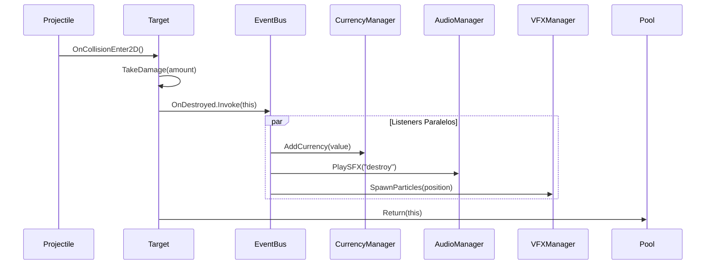
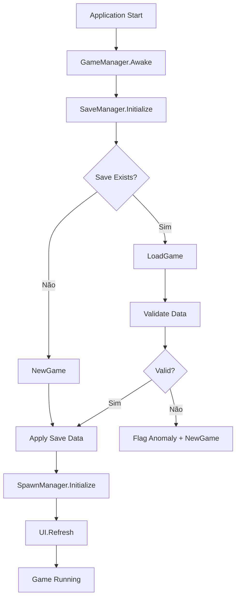

# Technical Design Document (TDD) - Architecture

## Propósito deste Documento

O coração técnico do projeto. Este documento guia **como** o jogo será construído. É focado em Engenharia de Software, Padrões de Projeto e Estrutura da Engine.

---

## Visão Geral Técnica

**Project Geometry Idle** é uma simulação de física baseada em Idle/Clicker Game. O diferencial técnico reside na **Engenharia de Performance** (gerenciamento de memória e física para milhares de entidades) e **Arquitetura de Dados Segura** (prevenção de cheat e persistência assíncrona).

---

## Tech Stack

### Ambiente de Desenvolvimento

| Ferramenta       | Versão / Detalhes                                      |
|------------------|--------------------------------------------------------|
| Engine           | Unity 6 (LTS) ou 2022.3 LTS                            |
| Linguagem        | C# (.NET Standard 2.1)                                 |
| IDE              | Visual Studio 2022 Community                           |
| Versionamento    | Git + GitHub (com `.gitignore` específico para Unity)  |
| Backend Services | Unity Gaming Services (UGS)                            |

### Bibliotecas e Frameworks

| Categoria      | Tecnologia                          | Justificativa                                      |
|----------------|-------------------------------------|----------------------------------------------------|
| Física         | Box2D (Nativo Unity 2D)             | Otimizado para 2D, sem overhead de 3D              |
| Async          | UniTask ou Tasks nativas .NET       | Operações I/O não bloqueantes                      |
| Matemática     | BigDouble (Struct customizada)      | Números superiores a 10^308                        |
| Serialização   | JsonUtility                         | Alta performance, baixa alocação                   |
| Analytics      | Unity Analytics                     | Métricas de gameplay e retenção                    |
| Remote Config  | Unity Remote Config                 | Balanceamento em tempo real sem rebuild            |

---

## Arquitetura de Software

O projeto segue princípios de **SOLID** e **Clean Code**, priorizando desacoplamento e performance.

### Padrões de Projeto (Design Patterns)

#### Observer Pattern (Event-Driven)

Utilização de `C# Actions/Events` para comunicação entre sistemas. A lógica do jogo (Model) não conhece a UI (View).

```csharp
// Exemplo: Target emite evento ao ser destruído
public class Target : MonoBehaviour
{
    public static event Action<Target, BigDouble> OnDestroyed;
    
    private void Die()
    {
        OnDestroyed?.Invoke(this, _rewardValue);
        gameObject.SetActive(false);
    }
}

// Sistemas escutam independentemente
public class CurrencyManager : MonoBehaviour
{
    private void OnEnable() => Target.OnDestroyed += HandleTargetDestroyed;
    private void OnDisable() => Target.OnDestroyed -= HandleTargetDestroyed;
    
    private void HandleTargetDestroyed(Target target, BigDouble value)
    {
        _currentCurrency += value;
    }
}
```

**Benefícios:**

- CurrencyManager, AudioManager e VFXManager reagem independentemente
- Fácil adicionar/remover comportamentos sem modificar a classe Target
- Testabilidade: sistemas podem ser testados isoladamente

#### Object Pooling

Reutilização agressiva de objetos para evitar alocação de memória e picos de Garbage Collection.

```csharp
public class ObjectPool<T> where T : Component
{
    private readonly Queue<T> _pool = new Queue<T>();
    private readonly T _prefab;
    private readonly Transform _parent;
    
    public T Get()
    {
        if (_pool.Count > 0)
        {
            var obj = _pool.Dequeue();
            obj.gameObject.SetActive(true);
            return obj;
        }
        return Object.Instantiate(_prefab, _parent);
    }
    
    public void Return(T obj)
    {
        obj.gameObject.SetActive(false);
        _pool.Enqueue(obj);
    }
}
```

**Objetos que usam Pool:**

- Projéteis (Projectile)
- Partículas de impacto
- Texto de dano flutuante (Floating Damage Text)
- Fragmentos de alvos destruídos

#### Singleton (Gerenciadores)

Acesso centralizado para sistemas globais com proteção contra duplicação.

```csharp
public abstract class Singleton<T> : MonoBehaviour where T : MonoBehaviour
{
    private static T _instance;
    
    public static T Instance
    {
        get
        {
            if (_instance == null)
            {
                _instance = FindObjectOfType<T>();
                if (_instance == null)
                {
                    Debug.LogError($"[Singleton] Nenhuma instância de {typeof(T)} encontrada!");
                }
            }
            return _instance;
        }
    }
    
    protected virtual void Awake()
    {
        if (_instance != null && _instance != this)
        {
            Destroy(gameObject);
            return;
        }
        _instance = this as T;
        DontDestroyOnLoad(gameObject);
    }
}
```

**Singletons do Projeto:**

- `GameManager` — Estado global do jogo
- `SaveManager` — Persistência de dados
- `AudioManager` — Efeitos sonoros e música

#### Strategy Pattern

Para comportamentos variáveis de upgrades e cálculos.

```csharp
public interface IDamageCalculator
{
    BigDouble Calculate(BigDouble baseDamage, UpgradeData upgrades);
}

public class StandardDamageCalculator : IDamageCalculator
{
    public BigDouble Calculate(BigDouble baseDamage, UpgradeData upgrades)
    {
        return baseDamage * upgrades.DamageMultiplier;
    }
}

public class CriticalDamageCalculator : IDamageCalculator
{
    public BigDouble Calculate(BigDouble baseDamage, UpgradeData upgrades)
    {
        var critMultiplier = Random.value < upgrades.CritChance ? upgrades.CritDamage : 1f;
        return baseDamage * upgrades.DamageMultiplier * critMultiplier;
    }
}
```

---

## Estrutura de Dados

### Big Numbers (BigDouble)

Uso de `Structs` (Value Types) ao invés de Classes para operações matemáticas frequentes, minimizando pressão no Heap.

```csharp
public readonly struct BigDouble
{
    public readonly double Mantissa; // 1.0 a 9.999...
    public readonly long Exponent;   // Potência de 10
    
    public BigDouble(double mantissa, long exponent)
    {
        // Normalização para manter mantissa entre 1 e 10
        while (mantissa >= 10)
        {
            mantissa /= 10;
            exponent++;
        }
        while (mantissa < 1 && mantissa > 0)
        {
            mantissa *= 10;
            exponent--;
        }
        
        Mantissa = mantissa;
        Exponent = exponent;
    }
    
    public static BigDouble operator +(BigDouble a, BigDouble b)
    {
        // Implementação de soma considerando expoentes diferentes
    }
    
    public override string ToString()
    {
        if (Exponent < 6) return (Mantissa * Math.Pow(10, Exponent)).ToString("N0");
        return $"{Mantissa:F2}e{Exponent}";
    }
}
```

**Por que Struct?**

- Alocado na Stack, não no Heap
- Sem pressão no Garbage Collector
- Operações matemáticas frequentes (a cada frame) não geram lixo

### ScriptableObjects como Banco de Dados

Utilizados para configuração de balanceamento, permitindo ajustes via Inspector sem recompilar código.

```csharp
[CreateAssetMenu(fileName = "ProjectileData", menuName = "Game/Projectile Data")]
public class ProjectileData : ScriptableObject
{
    [Header("Atributos Base")]
    public float BaseSpeed = 10f;
    public float BaseDamage = 1f;
    
    [Header("Custos de Upgrade")]
    public AnimationCurve UpgradeCostCurve;
    public float BaseCost = 10f;
    public float CostMultiplier = 1.15f;
    
    public BigDouble GetUpgradeCost(int level)
    {
        return new BigDouble(BaseCost * UpgradeCostCurve.Evaluate(level) * Mathf.Pow(CostMultiplier, level), 0);
    }
}
```

---

## Estrutura de Pastas

```text
Assets/
├── _Project/                 # Todo o conteúdo autoral do projeto
│   ├── Animations/
│   ├── Audio/
│   ├── Data/                 # ScriptableObjects (Configurações)
│   ├── Materials/            # Materiais Físicos e Visuais
│   ├── Prefabs/
│   │   ├── Core/             # Projéteis, Alvos
│   │   ├── UI/               # Menus, Popups
│   │   └── Systems/          # Managers (Não visuais)
│   ├── Scenes/
│   ├── Scripts/
│   │   ├── Core/             # Lógica principal (Game Loop)
│   │   ├── Systems/          # Save, Audio, Pooling
│   │   ├── Controllers/      # Input, Camera
│   │   ├── UI/               # View Logic
│   │   ├── Data/             # Modelos de Dados (Structs, BigDouble)
│   │   ├── Utils/            # Helpers, Extensions
│   │   └── Security/         # Anti-cheat, Obfuscation
│   ├── Sprites/              # Assets 2D (Greyboxing inicial)
│   └── Tests/                # PlayMode e EditMode Tests
├── Plugins/                  # SDKs de terceiros (Unity Analytics, etc)
└── Settings/                 # Configurações de Render Pipeline
```

### Convenção de Namespaces

```csharp
namespace GeometryIdle.Core { }        // Game Loop, Managers
namespace GeometryIdle.Systems { }     // Save, Audio, Pool
namespace GeometryIdle.Controllers { } // Input, Camera
namespace GeometryIdle.UI { }          // Views, Presenters
namespace GeometryIdle.Data { }        // Structs, Models
namespace GeometryIdle.Utils { }       // Extensions, Helpers
namespace GeometryIdle.Security { }    // Anti-cheat
```

---

## Diagramas de Comunicação

### Fluxo de Evento: Alvo Destruído



### Fluxo de Inicialização



---

## DevOps e Monitoramento

### Unity Remote Config

Variáveis de balanceamento hospedadas na nuvem, permitindo ajustes sem atualizar o build:

| Variável           | Tipo   | Descrição                    |
|--------------------|--------|------------------------------|
| `base_damage`      | float  | Dano base inicial            |
| `cost_multiplier`  | float  | Multiplicador de custo       |
| `spawn_rate`       | float  | Intervalo de spawn (seg)     |
| `offline_cap_hours`| int    | Limite de ganhos offline     |

### Cloud Diagnostics

- Envio automático de Stack Traces em exceções fatais
- Crash reports com device info
- Métricas de performance (FPS médio, picos de GC)