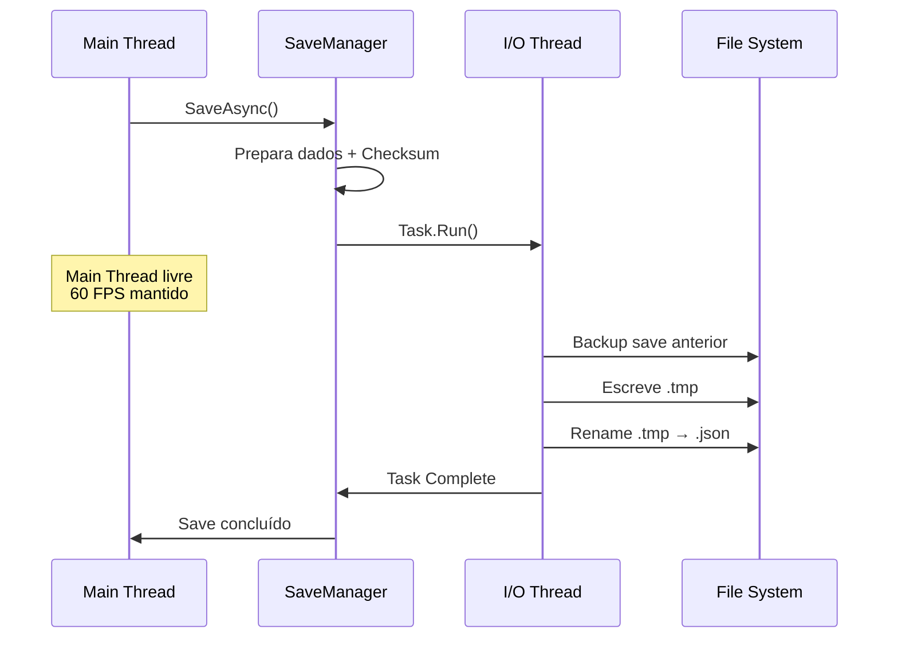
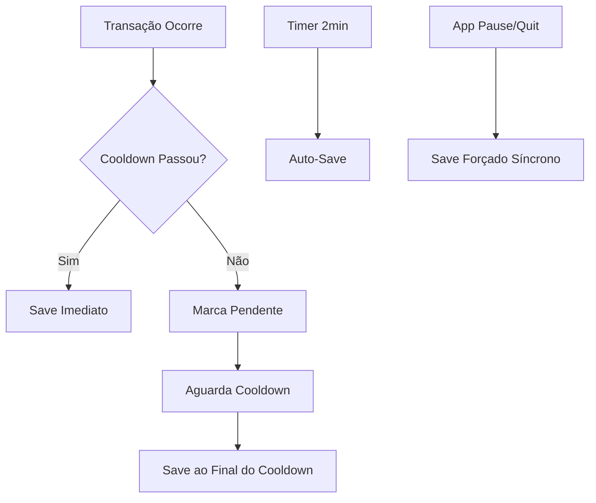
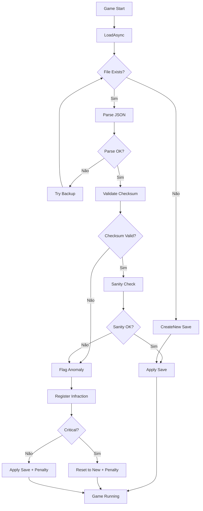

# Data Persistence & Security

## Propósito deste Documento

Detalha como os dados do jogador são salvos, carregados e protegidos. Crucial para garantir que o progresso não seja perdido e para mitigar trapaças (cheats) simples.

---

## Save System

### Estrutura do Arquivo de Save

O progresso do jogador é serializado em JSON para facilitar debugging durante desenvolvimento e manter compatibilidade entre versões.

```json
{
    "version": "1.0.0",
    "lastSaveTimestamp": 1699876543,
    "playTimeSeconds": 3600,
    "currency": {
        "primary": { "mantissa": 1.5, "exponent": 12 },
        "premium": { "mantissa": 50.0, "exponent": 0 }
    },
    "stats": {
        "totalDamageDealt": { "mantissa": 9.99, "exponent": 15 },
        "targetsDestroyed": 150000,
        "highestCombo": 512
    },
    "upgrades": {
        "damage": 45,
        "spawnRate": 30,
        "projectileCount": 12,
        "critChance": 20,
        "critDamage": 15
    },
    "unlocks": {
        "projectileTypes": ["basic", "type_b", "type_c"],
        "backgrounds": ["default", "theme_2"]
    },
    "settings": {
        "musicVolume": 0.8,
        "sfxVolume": 1.0,
        "particleQuality": 2
    },
    "checksum": "a1b2c3d4e5f6"
}
```

### Localização do Arquivo

| Plataforma | Caminho                                              |
|------------|------------------------------------------------------|
| Windows    | `%USERPROFILE%/AppData/LocalLow/Studio/GameName/`    |
| macOS      | `~/Library/Application Support/Studio/GameName/`     |
| Linux      | `~/.config/unity3d/Studio/GameName/`                 |
| Android    | `Application.persistentDataPath` (interno protegido) |
| iOS        | `Application.persistentDataPath` (sandbox)           |

```csharp
public static class SavePaths
{
    public static string SaveDirectory => Application.persistentDataPath;
    public static string SaveFile => Path.Combine(SaveDirectory, "save.json");
    public static string BackupFile => Path.Combine(SaveDirectory, "save.backup.json");
}
```

### Modelo de Dados (SaveData)

```csharp
[Serializable]
public class SaveData
{
    public string Version;
    public long LastSaveTimestamp;
    public long PlayTimeSeconds;
    
    public CurrencyData Currency;
    public StatsData Stats;
    public UpgradesData Upgrades;
    public UnlocksData Unlocks;
    public SettingsData Settings;
    
    public string Checksum;
    
    public static SaveData CreateNew()
    {
        return new SaveData
        {
            Version = Application.version,
            LastSaveTimestamp = DateTimeOffset.UtcNow.ToUnixTimeSeconds(),
            PlayTimeSeconds = 0,
            Currency = new CurrencyData(),
            Stats = new StatsData(),
            Upgrades = new UpgradesData(),
            Unlocks = new UnlocksData(),
            Settings = new SettingsData()
        };
    }
}

[Serializable]
public class CurrencyData
{
    public SerializableBigDouble Primary = new(0, 0);
    public SerializableBigDouble Premium = new(0, 0);
}

[Serializable]
public struct SerializableBigDouble
{
    public double Mantissa;
    public long Exponent;
    
    public SerializableBigDouble(double mantissa, long exponent)
    {
        Mantissa = mantissa;
        Exponent = exponent;
    }
    
    public BigDouble ToBigDouble() => new(Mantissa, Exponent);
    public static SerializableBigDouble FromBigDouble(BigDouble bd) => new(bd.Mantissa, bd.Exponent);
}
```

---

## Async I/O

Toda operação de escrita no disco é executada em **Thread Secundária** para garantir que a Thread Principal (Rendering/Physics) permaneça a 60 FPS estáveis.

### Implementação

```csharp
public class SaveManager : Singleton<SaveManager>
{
    private SaveData _currentSave;
    private bool _isSaving;
    
    public async Task SaveAsync()
    {
        if (_isSaving) return;
        _isSaving = true;
        
        try
        {
            // Prepara dados na Main Thread
            _currentSave.LastSaveTimestamp = DateTimeOffset.UtcNow.ToUnixTimeSeconds();
            _currentSave.Checksum = GenerateChecksum(_currentSave);
            
            string json = JsonUtility.ToJson(_currentSave, prettyPrint: false);
            string path = SavePaths.SaveFile;
            string backupPath = SavePaths.BackupFile;
            
            // Escrita em Thread Secundária
            await Task.Run(() =>
            {
                // Backup do save anterior
                if (File.Exists(path))
                {
                    File.Copy(path, backupPath, overwrite: true);
                }
                
                // Escrita atômica: escreve em temp, depois renomeia
                string tempPath = path + ".tmp";
                File.WriteAllText(tempPath, json);
                File.Move(tempPath, path, overwrite: true);
            });
            
            Debug.Log("[SaveManager] Save concluído com sucesso.");
        }
        catch (Exception e)
        {
            Debug.LogError($"[SaveManager] Erro ao salvar: {e.Message}");
        }
        finally
        {
            _isSaving = false;
        }
    }
    
    public async Task<SaveData> LoadAsync()
    {
        string path = SavePaths.SaveFile;
        
        if (!File.Exists(path))
        {
            Debug.Log("[SaveManager] Nenhum save encontrado. Criando novo.");
            return SaveData.CreateNew();
        }
        
        try
        {
            string json = await Task.Run(() => File.ReadAllText(path));
            var saveData = JsonUtility.FromJson<SaveData>(json);
            
            // Validação de integridade
            if (!ValidateChecksum(saveData))
            {
                Debug.LogWarning("[SaveManager] Checksum inválido! Tentando backup...");
                return await LoadBackupAsync();
            }
            
            return saveData;
        }
        catch (Exception e)
        {
            Debug.LogError($"[SaveManager] Erro ao carregar: {e.Message}");
            return await LoadBackupAsync();
        }
    }
    
    private async Task<SaveData> LoadBackupAsync()
    {
        string backupPath = SavePaths.BackupFile;
        
        if (!File.Exists(backupPath))
        {
            Debug.LogWarning("[SaveManager] Backup não encontrado. Criando save novo.");
            return SaveData.CreateNew();
        }
        
        try
        {
            string json = await Task.Run(() => File.ReadAllText(backupPath));
            return JsonUtility.FromJson<SaveData>(json);
        }
        catch
        {
            return SaveData.CreateNew();
        }
    }
}
```

### Fluxo de Save Assíncrono



---

## Estratégia Híbrida de Save (Debounce Logic)

O sistema combina múltiplas estratégias para garantir persistência sem impactar performance.

### Triggers de Save

| Trigger               | Intervalo    | Prioridade | Descrição                                      |
|-----------------------|--------------|------------|------------------------------------------------|
| **Transaction Save**  | Imediato*    | Alta       | Compras, desbloqueios, milestones              |
| **Auto-Save**         | 2 minutos    | Média      | Backup periódico de progresso passivo          |
| **Exit Save**         | Imediato     | Crítica    | Ao fechar app ou ir para background            |
| **Pause Save**        | Imediato     | Alta       | Ao pausar o jogo                               |

*\* Com debounce de 60 segundos entre transações*

### Implementação do Debounce

```csharp
public class SaveScheduler : MonoBehaviour
{
    [SerializeField] private float _autoSaveInterval = 120f;
    [SerializeField] private float _transactionCooldown = 60f;
    
    private float _lastTransactionSave;
    private float _autoSaveTimer;
    private bool _pendingTransactionSave;
    
    private void Update()
    {
        // Auto-Save periódico
        _autoSaveTimer += Time.deltaTime;
        if (_autoSaveTimer >= _autoSaveInterval)
        {
            _autoSaveTimer = 0f;
            _ = SaveManager.Instance.SaveAsync();
        }
        
        // Processa transaction save pendente após cooldown
        if (_pendingTransactionSave && Time.time - _lastTransactionSave >= _transactionCooldown)
        {
            _pendingTransactionSave = false;
            _ = SaveManager.Instance.SaveAsync();
        }
    }
    
    /// <summary>
    /// Chamado por sistemas ao realizar transações importantes.
    /// </summary>
    public void RequestTransactionSave()
    {
        if (Time.time - _lastTransactionSave >= _transactionCooldown)
        {
            // Cooldown passou, salva imediatamente
            _lastTransactionSave = Time.time;
            _ = SaveManager.Instance.SaveAsync();
        }
        else
        {
            // Ainda em cooldown, agenda para depois
            _pendingTransactionSave = true;
        }
    }
    
    private void OnApplicationPause(bool pauseStatus)
    {
        if (pauseStatus)
        {
            // Força save síncrono ao pausar (mobile background)
            SaveManager.Instance.SaveAsync().Wait();
        }
    }
    
    private void OnApplicationQuit()
    {
        SaveManager.Instance.SaveAsync().Wait();
    }
}
```

### Fluxo de Debounce



---

## Anti-Cheat

### Ofuscação de Memória (Memory Obfuscation)

Variáveis sensíveis não são armazenadas como valores puros na memória. Uma `Struct` encapsulada aplica operação **XOR** com chave aleatória, dificultando localização via Memory Scanners (ex: Cheat Engine).

```csharp
public struct ObfuscatedInt
{
    private int _obfuscatedValue;
    private int _key;
    
    public ObfuscatedInt(int value)
    {
        _key = UnityEngine.Random.Range(int.MinValue, int.MaxValue);
        _obfuscatedValue = value ^ _key;
    }
    
    public int Value
    {
        get => _obfuscatedValue ^ _key;
        set => _obfuscatedValue = value ^ _key;
    }
    
    // Re-randomiza a chave periodicamente para dificultar ainda mais
    public void Rehash()
    {
        int currentValue = Value;
        _key = UnityEngine.Random.Range(int.MinValue, int.MaxValue);
        _obfuscatedValue = currentValue ^ _key;
    }
    
    // Operadores implícitos para uso transparente
    public static implicit operator int(ObfuscatedInt o) => o.Value;
    public static implicit operator ObfuscatedInt(int v) => new(v);
}

public struct ObfuscatedBigDouble
{
    private double _obfuscatedMantissa;
    private long _obfuscatedExponent;
    private long _key;
    
    public ObfuscatedBigDouble(BigDouble value)
    {
        _key = UnityEngine.Random.Range(long.MinValue, long.MaxValue);
        _obfuscatedMantissa = BitConverter.Int64BitsToDouble(
            BitConverter.DoubleToInt64Bits(value.Mantissa) ^ _key
        );
        _obfuscatedExponent = value.Exponent ^ _key;
    }
    
    public BigDouble Value
    {
        get
        {
            double mantissa = BitConverter.Int64BitsToDouble(
                BitConverter.DoubleToInt64Bits(_obfuscatedMantissa) ^ _key
            );
            long exponent = _obfuscatedExponent ^ _key;
            return new BigDouble(mantissa, exponent);
        }
        set
        {
            _obfuscatedMantissa = BitConverter.Int64BitsToDouble(
                BitConverter.DoubleToInt64Bits(value.Mantissa) ^ _key
            );
            _obfuscatedExponent = value.Exponent ^ _key;
        }
    }
}
```

### Uso no Código

```csharp
public class PlayerWallet : MonoBehaviour
{
    // ❌ Vulnerável - valor puro na memória
    // private BigDouble _currency;
    
    // ✅ Protegido - valor ofuscado
    private ObfuscatedBigDouble _currency;
    
    public BigDouble Currency
    {
        get => _currency.Value;
        set => _currency = new ObfuscatedBigDouble(value);
    }
    
    private void Update()
    {
        // Re-hash periódico (a cada ~10 segundos)
        if (Time.frameCount % 600 == 0)
        {
            _currency = new ObfuscatedBigDouble(_currency.Value);
        }
    }
}
```

### Sanity Checks (Validação de Integridade)

Ao carregar save ou realizar compras, o sistema verifica se os valores são matematicamente possíveis.

```csharp
public class SanityValidator
{
    // Constantes de validação
    private const double MAX_CURRENCY_PER_SECOND = 1e12;
    private const double MAX_DAMAGE_PER_SECOND = 1e15;
    private const int MAX_UPGRADES_PER_HOUR = 500;
    
    public ValidationResult Validate(SaveData save)
    {
        var result = new ValidationResult();
        
        // Verifica currency vs tempo jogado
        BigDouble maxPossibleCurrency = CalculateMaxCurrency(save.PlayTimeSeconds);
        if (save.Currency.Primary.ToBigDouble() > maxPossibleCurrency * 1.5)
        {
            result.AddAnomaly(AnomalyType.CurrencyOverflow, 
                $"Currency excede máximo possível para tempo jogado");
        }
        
        // Verifica dano vs tempo jogado
        BigDouble maxPossibleDamage = CalculateMaxDamage(save.PlayTimeSeconds);
        if (save.Stats.TotalDamageDealt.ToBigDouble() > maxPossibleDamage * 1.5)
        {
            result.AddAnomaly(AnomalyType.DamageOverflow,
                $"Dano total suspeito para tempo de jogo");
        }
        
        // Verifica upgrades vs currency gasto possível
        int totalUpgradeLevels = save.Upgrades.GetTotalLevels();
        BigDouble costOfAllUpgrades = CalculateUpgradeCost(totalUpgradeLevels);
        if (costOfAllUpgrades > maxPossibleCurrency * 2)
        {
            result.AddAnomaly(AnomalyType.UpgradeAnomaly,
                $"Upgrades impossíveis para currency gerado");
        }
        
        // Verifica timestamp (não pode ser do futuro)
        long now = DateTimeOffset.UtcNow.ToUnixTimeSeconds();
        if (save.LastSaveTimestamp > now + 60)
        {
            result.AddAnomaly(AnomalyType.TimeTamper,
                "Timestamp do save está no futuro");
        }
        
        return result;
    }
    
    private BigDouble CalculateMaxCurrency(long playTimeSeconds)
    {
        return new BigDouble(MAX_CURRENCY_PER_SECOND * playTimeSeconds, 0);
    }
    
    private BigDouble CalculateMaxDamage(long playTimeSeconds)
    {
        return new BigDouble(MAX_DAMAGE_PER_SECOND * playTimeSeconds, 0);
    }
    
    private BigDouble CalculateUpgradeCost(int totalLevels)
    {
        return new BigDouble(Math.Pow(1.15, totalLevels) * 10, 0);
    }
}

public class ValidationResult
{
    public List<Anomaly> Anomalies { get; } = new();
    public bool IsValid => Anomalies.Count == 0;
    public bool HasCriticalAnomaly => Anomalies.Any(a => a.IsCritical);
    
    public void AddAnomaly(AnomalyType type, string message)
    {
        Anomalies.Add(new Anomaly(type, message));
    }
}

public enum AnomalyType
{
    CurrencyOverflow,
    DamageOverflow,
    UpgradeAnomaly,
    TimeTamper,
    ChecksumMismatch
}
```

---

## Soft Ban System

Em caso de detecção de anomalia, o jogador **não é banido**. O sistema aplica um "Resfriamento" progressivo.

### Níveis de Penalidade

| Infração | Cooldown   | Ações Bloqueadas                    |
|----------|------------|-------------------------------------|
| 1ª       | 1 minuto   | Compras de upgrade                  |
| 2ª       | 10 minutos | Compras + Ganho de currency         |
| 3ª       | 60 minutos | Compras + Ganho + Spawns            |
| 4ª+      | 24 horas   | Jogo em modo "espectador"           |

### Implementação

```csharp
public class PenaltyManager : Singleton<PenaltyManager>
{
    private int _infractionCount;
    private DateTime _penaltyEndTime;
    
    public bool IsOnCooldown => DateTime.UtcNow < _penaltyEndTime;
    public TimeSpan RemainingCooldown => _penaltyEndTime - DateTime.UtcNow;
    public int CurrentPenaltyLevel => _infractionCount;
    
    public void RegisterInfraction(AnomalyType type, string details)
    {
        _infractionCount++;
        
        int cooldownMinutes = _infractionCount switch
        {
            1 => 1,
            2 => 10,
            3 => 60,
            _ => 1440 // 24 horas
        };
        
        _penaltyEndTime = DateTime.UtcNow.AddMinutes(cooldownMinutes);
        
        Debug.LogWarning($"[PenaltyManager] Infração #{_infractionCount}: {type}");
        
        OnPenaltyApplied?.Invoke(_infractionCount, cooldownMinutes);
    }
    
    public bool CanPerformAction(GameAction action)
    {
        if (!IsOnCooldown) return true;
        
        return _infractionCount switch
        {
            1 => action != GameAction.Purchase,
            2 => action != GameAction.Purchase && action != GameAction.EarnCurrency,
            3 => action == GameAction.ViewOnly,
            _ => false
        };
    }
    
    public event Action<int, int> OnPenaltyApplied;
}

public enum GameAction
{
    Purchase,
    EarnCurrency,
    SpawnProjectile,
    ViewOnly
}
```

### Mensagem In-Game

```csharp
public class PenaltyUI : MonoBehaviour
{
    [SerializeField] private GameObject _penaltyPanel;
    [SerializeField] private TMP_Text _penaltyMessage;
    [SerializeField] private TMP_Text _timerText;
    
    private void OnEnable()
    {
        PenaltyManager.Instance.OnPenaltyApplied += ShowPenalty;
    }
    
    private void ShowPenalty(int level, int minutes)
    {
        _penaltyPanel.SetActive(true);
        _penaltyMessage.text = "Sistema instável detectado.\nAguarde resfriamento.";
    }
    
    private void Update()
    {
        if (PenaltyManager.Instance.IsOnCooldown)
        {
            var remaining = PenaltyManager.Instance.RemainingCooldown;
            _timerText.text = $"{remaining.Minutes:D2}:{remaining.Seconds:D2}";
        }
        else
        {
            _penaltyPanel.SetActive(false);
        }
    }
}
```

---

## Checksum do Save

Gera hash do save para detectar modificação manual do arquivo JSON.

```csharp
public static class ChecksumUtils
{
    private const string SALT = "GeometryIdle_2024_Salt";
    
    public static string Generate(SaveData save)
    {
        string dataString = string.Concat(
            save.Currency.Primary.Mantissa,
            save.Currency.Primary.Exponent,
            save.Currency.Premium.Mantissa,
            save.PlayTimeSeconds,
            save.Upgrades.Damage,
            save.Upgrades.ProjectileCount,
            SALT
        );
        
        using (var sha256 = SHA256.Create())
        {
            byte[] bytes = sha256.ComputeHash(Encoding.UTF8.GetBytes(dataString));
            return Convert.ToBase64String(bytes).Substring(0, 12);
        }
    }
    
    public static bool Validate(SaveData save)
    {
        string expected = Generate(save);
        return save.Checksum == expected;
    }
}
```

---

## Fluxo Completo: Load com Validação

