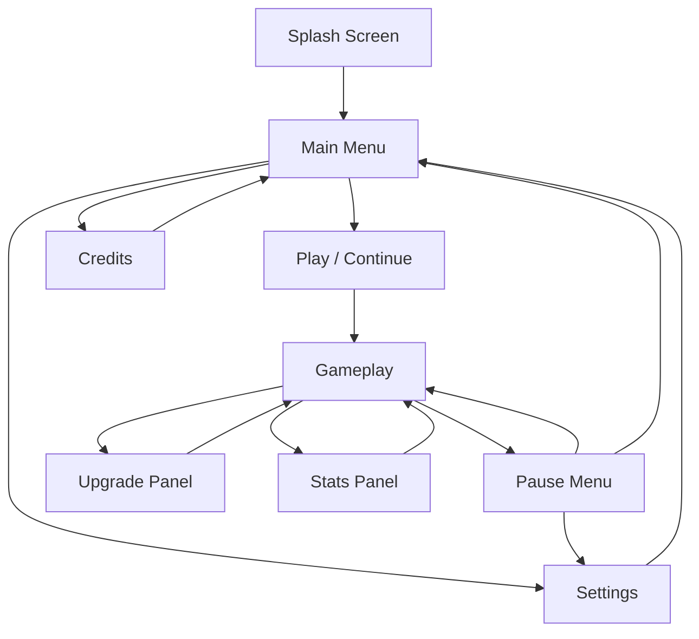

# UI/UX & User Flow

## Propósito deste Documento

Foca na experiência do usuário e na interface. Define como o jogador navega pelo jogo e como as informações são apresentadas na tela.

> ⚠️ **Nota:** Este documento descreve estrutura e fluxo. O estilo visual (cores, fontes, ícones) será definido no Art Bible após escolha do tema.

---

## Princípios de UX

### Filosofia

1. **Mínima Fricção:** O jogador deve poder jogar sem ler tutoriais
2. **Informação Clara:** Números importantes sempre visíveis
3. **Feedback Imediato:** Toda ação tem resposta visual/sonora
4. **Não-Intrusivo:** UI não compete com a gameplay

### Regras de Design

| Regra                    | Implementação                                    |
|--------------------------|--------------------------------------------------|
| Hierarquia Visual        | Currency e upgrades mais destacados que stats    |
| Consistência             | Mesmo padrão de botões em todas as telas         |
| Acessibilidade           | Tamanho mínimo de toque 44x44px (mobile-ready)   |
| Responsividade           | UI adapta para diferentes aspect ratios          |

---

## User Flow

### Diagrama de Navegação



### Descrição dos Estados

| Tela           | Função                                           | Tempo Típico |
|----------------|--------------------------------------------------|--------------|
| Splash Screen  | Logo do estúdio, carregamento inicial            | 2-3s         |
| Main Menu      | Ponto de entrada, opções principais              | 5-10s        |
| Gameplay       | Loop principal, onde o jogo acontece             | Indefinido   |
| Pause Menu     | Pausa, acesso a settings, sair                   | 10-30s       |
| Upgrade Panel  | Compra de melhorias (overlay sobre gameplay)     | 30s-2min     |
| Stats Panel    | Estatísticas detalhadas                          | 10-30s       |
| Settings       | Configurações de áudio, gráficos                 | 30s-1min     |
| Credits        | Créditos da equipe                               | 30s          |

---

## Wireframes

### Tela: Main Menu

```
┌─────────────────────────────────────────┐
│                                         │
│           [LOGO DO JOGO]                │
│                                         │
│         ┌─────────────────┐             │
│         │     JOGAR       │             │
│         └─────────────────┘             │
│                                         │
│         ┌─────────────────┐             │
│         │  CONFIGURAÇÕES  │             │
│         └─────────────────┘             │
│                                         │
│         ┌─────────────────┐             │
│         │    CRÉDITOS     │             │
│         └─────────────────┘             │
│                                         │
│                          v1.0.0         │
└─────────────────────────────────────────┘
```

### Tela: Gameplay (HUD)

```
┌─────────────────────────────────────────┐
│ ┌─────────┐              ┌────────────┐ │
│ │ 💰 1.5M │              │  ⚙️  ⏸️   │ │
│ └─────────┘              └────────────┘ │
│                                         │
│                                         │
│                                         │
│          [ÁREA DE GAMEPLAY]             │
│                                         │
│      Projéteis e Alvos renderizam       │
│              aqui                       │
│                                         │
│                                         │
│                                         │
│ ┌─────────────────────────────────────┐ │
│ │  [UPGRADE]  [STATS]  [BOOST?]       │ │
│ └─────────────────────────────────────┘ │
└─────────────────────────────────────────┘
```

**Elementos do HUD:**

| Elemento       | Posição        | Função                              |
|----------------|----------------|-------------------------------------|
| Currency       | Top-Left       | Mostra moeda atual                  |
| Settings/Pause | Top-Right      | Acesso rápido a menu                |
| Action Bar     | Bottom         | Botões de upgrade, stats, etc       |

### Tela: Upgrade Panel (Overlay)

```
┌─────────────────────────────────────────┐
│ ┌─────────────────────────────────────┐ │
│ │           UPGRADES            [X]   │ │
│ └─────────────────────────────────────┘ │
│                                         │
│ ┌─────────────────────────────────────┐ │
│ │ ⚔️ Damage          Lv.45            │ │
│ │ +10% per level                      │ │
│ │ [████████░░] → Lv.46                │ │
│ │              Cost: 1.2K   [COMPRAR] │ │
│ └─────────────────────────────────────┘ │
│                                         │
│ ┌─────────────────────────────────────┐ │
│ │ 🎯 Spawn Rate      Lv.30            │ │
│ │ -0.05s per level                    │ │
│ │ [██████████] MAX                    │ │
│ │              -             [MAX]    │ │
│ └─────────────────────────────────────┘ │
│                                         │
│ ┌─────────────────────────────────────┐ │
│ │ 🔢 Projectiles     Lv.12            │ │
│ │ +1 per level                        │ │
│ │ [██████░░░░] → Lv.13                │ │
│ │              Cost: 50K    [COMPRAR] │ │
│ └─────────────────────────────────────┘ │
│                                         │
└─────────────────────────────────────────┘
```

**Elementos por Upgrade:**

- Ícone + Nome
- Nível atual
- Descrição do efeito
- Barra de progresso visual
- Custo + Botão de compra

### Tela: Pause Menu

```
┌─────────────────────────────────────────┐
│                                         │
│              PAUSADO                    │
│                                         │
│         ┌─────────────────┐             │
│         │    CONTINUAR    │             │
│         └─────────────────┘             │
│                                         │
│         ┌─────────────────┐             │
│         │  CONFIGURAÇÕES  │             │
│         └─────────────────┘             │
│                                         │
│         ┌─────────────────┐             │
│         │   MENU INICIAL  │             │
│         └─────────────────┘             │
│                                         │
└─────────────────────────────────────────┘
```

### Tela: Settings

```
┌─────────────────────────────────────────┐
│ ┌─────────────────────────────────────┐ │
│ │         CONFIGURAÇÕES         [X]   │ │
│ └─────────────────────────────────────┘ │
│                                         │
│   Música                                │
│   [████████░░░░░░░░░░] 80%              │
│                                         │
│   Efeitos Sonoros                       │
│   [████████████████████] 100%           │
│                                         │
│   Qualidade de Partículas               │
│   [ Baixa ] [ Média ] [*Alta*]          │
│                                         │
│   ─────────────────────────────────     │
│                                         │
│   [  RESETAR PROGRESSO  ]               │
│   (Requer confirmação)                  │
│                                         │
└─────────────────────────────────────────┘
```

---

## Feedback Visual

### Sistema de Feedback

| Evento                  | Feedback Visual                         | Feedback Sonoro |
|-------------------------|-----------------------------------------|-----------------|
| Alvo atingido           | Flash branco no alvo                    | Hit sound       |
| Alvo destruído          | Partículas de explosão                  | Destroy sound   |
| Currency ganho          | Número flutuante (+10)                  | Coin sound      |
| Upgrade comprado        | Flash no botão, número incrementa       | Purchase sound  |
| Upgrade indisponível    | Botão acinzentado, shake on click       | Error sound     |
| Level up (se houver)    | Overlay de celebração                   | Fanfare         |
| Crítico                 | Número maior, cor diferente             | Crit sound      |

### Floating Text (Damage Numbers)

```csharp
// Comportamento do texto flutuante
public class FloatingText : MonoBehaviour
{
    // Spawna na posição do hit
    // Sobe lentamente (ease out)
    // Fade out ao longo de 1 segundo
    // Retorna ao pool após fade
    
    // Variações:
    // - Normal: tamanho padrão, cor A
    // - Crítico: 1.5x tamanho, cor B, "CRIT!" acima
    // - Currency: cor dourada, ícone de moeda
}
```

### Screen Effects

| Efeito            | Trigger                    | Intensidade |
|-------------------|----------------------------|-------------|
| Screen Shake      | Hit crítico, boss destruído| Leve (2-3px)|
| Flash de impacto  | Múltiplos hits rápidos     | Sutil       |
| Slow Motion       | (Opcional) Destruição grande| 0.5x por 0.5s|

---

## Responsividade

### Breakpoints

| Aspect Ratio | Adaptação                                    |
|--------------|----------------------------------------------|
| 16:9         | Layout padrão (referência)                   |
| 21:9         | Área de gameplay expandida lateralmente      |
| 4:3          | UI compacta, menos padding                   |
| 9:16 (Mobile)| Layout vertical, botões maiores              |

### Safe Areas

```
┌─────────────────────────────────────────┐
│ ░░░░░░░░░░░░░░░░░░░░░░░░░░░░░░░░░░░░░░░ │  ← Notch/Cutout zone
│ ┌─────────────────────────────────────┐ │
│ │                                     │ │
│ │         SAFE AREA                   │ │
│ │    (Todo conteúdo interativo        │ │
│ │     deve estar aqui)                │ │
│ │                                     │ │
│ └─────────────────────────────────────┘ │
│ ░░░░░░░░░░░░░░░░░░░░░░░░░░░░░░░░░░░░░░░ │  ← Home indicator zone
└─────────────────────────────────────────┘
```

---

## Animações de UI

### Transições

| Transição        | Duração | Easing           |
|------------------|---------|------------------|
| Abrir painel     | 0.3s    | Ease Out Cubic   |
| Fechar painel    | 0.2s    | Ease In Cubic    |
| Botão hover      | 0.1s    | Linear           |
| Botão press      | 0.05s   | Linear           |
| Número incrementa| 0.5s    | Ease Out         |

### Princípios

1. **Responsivo:** Animações não bloqueiam input
2. **Skippable:** Segurar toque/click pula animação
3. **Consistente:** Mesmo timing em elementos similares

---

## Acessibilidade

### Requisitos Mínimos

- [ ] Contraste mínimo 4.5:1 para texto
- [ ] Tamanho mínimo de fonte: 14px (mobile: 16px)
- [ ] Touch targets mínimo: 44x44px
- [ ] Não depender apenas de cor para informação
- [ ] Suporte a redução de movimento (prefers-reduced-motion)

### Opções Futuras

- Modo daltônico (paleta alternativa)
- Tamanho de fonte ajustável
- Desabilitar screen shake
- Narração de UI (TTS)

---

## Referência de Componentes

### Hierarquia de Canvas

```
Canvas (Screen Space - Overlay)
├── HUD
│   ├── TopBar
│   │   ├── CurrencyDisplay
│   │   └── SettingsButton
│   └── BottomBar
│       ├── UpgradeButton
│       ├── StatsButton
│       └── BoostButton
├── Panels
│   ├── UpgradePanel
│   ├── StatsPanel
│   ├── PausePanel
│   └── SettingsPanel
├── Popups
│   ├── ConfirmationPopup
│   └── WelcomeBackPopup
└── Effects
    ├── FloatingTextContainer
    └── ScreenFlash
```